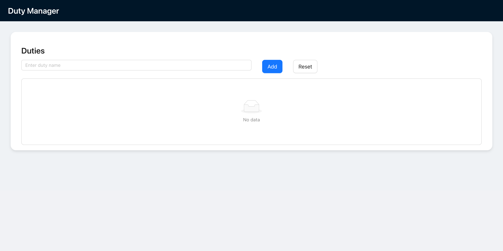

# Duty Manager App

A full-stack task management application built with **React**, **TypeScript**, **Ant Design**, **Node**, **Express** and **PostgreSQL**. It allows users to add, edit, complete, and delete "duties" via a clean and responsive interface.

## 🚀 Features
- ✅ Add new duties
- 📝 Edit duties
- ❌ Delete duties
- ✔️ Mark duties as complete
  
## 🛠 Tech Stack

### Frontend
- React (with Vite)
- TypeScript
- Ant Design
- React Testing Library + Vitest

### Backend
- Node.js (18)
- Express.js
- PostgreSQL
- TypeScript
- Jest
  
## 🐳 Run with Docker
```bash
docker compose up --build
```

## Setup locally
### Frontend
```bash
cd frontend
npm install
npm run dev
```

### Backend
```bash
cd backend
npm install
npm run start
```

## 🧪 Run Tests
```bash
npm run test
```

## 🖼️ Screenshots

### 📋 App Home


### Form validation


### Home with Duties


### Edit Duty


## 🧑‍💻 Author
Made with ❤️ by Andres Auais
